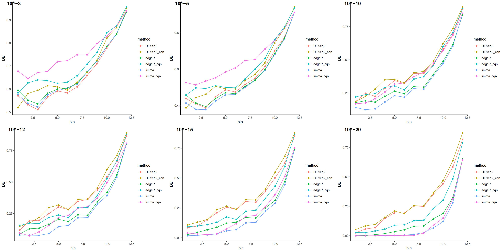
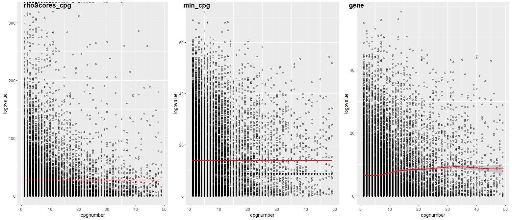

# GeoTcgaData

The goal of GeoTcgaData is to deal with RNA-seq, DNA Methylation, single nucleotide Variation and Copy number variation data in GEO and TCGA.

## :writing_hand: Authors
Erqiang Hu

 Department of Bioinformatics, School of Basic Medical Sciences, Southern Medical University.

[](https://cran.r-project.org/package=GeoTcgaData)


## :arrow\_double\_down: Installation

Get the released version from CRAN:

``` r
install.packages("GeoTcgaData")
```

Or  the development version from github:

```r
if(!requireNamespace("devtools", quietly = TRUE))
    install.packages("devtools")
devtools::install_github("YuLab-SMU/GeoTcgaData")
```

GEO and TCGA provide us with a wealth of data, such as RNA-seq, DNA Methylation,   single nucleotide Variation and Copy number variation data. It's easy to download data from TCGA using the  gdc tool or `TCGAbiolinks`,  and some software provides organized TCGA data, such as [UCSC Xena](http://xena.ucsc.edu/) , [UCSCXenaTools](https://cran.r-project.org/package=UCSCXenaTools)，and [sangerbox](http://vip.sangerbox.com/), but processing these data into a format suitable for bioinformatics  analysis requires more work. This R package was developed to handle these data.

## Example

This is a basic example which shows you how to solve a common problem:

## RNA-seq data differential expression analysis
It is convenient to use [`TCGAbiolinks`](http://www.bioconductor.org/packages/release/bioc/vignettes/TCGAbiolinks/inst/doc/analysis.html)  or [`GDCRNATools`](https://bioconductor.org/packages/GDCRNATools/) to download and analysis Gene expression data.  `TCGAbiolinks` use `edgeR` package to do differential expression analysis, while `GDCRNATools` can implement three most commonly used methods: limma, edgeR , and DESeq2 to identify differentially expressed  genes (DEGs).

However, unlike the chip data, the RNA-seq data had one [bias](https://pubmed.ncbi.nlm.nih.gov/20132535/): the larger the transcript length / mean read count , the more likely it was to be  identified as a differential gene, [while there was no such trend in the chip data](https://pubmed.ncbi.nlm.nih.gov/19371405/). It is worse noting that [only technical replicate data, which has small gene dispersions, shows this bias](https://pubmed.ncbi.nlm.nih.gov/28545404/). This is because in technical replicate RNA-seq data a long gene has more reads mapping to it compared to a short gene of similar expression,  and most of the statistical methods used to detect differential expression  have stronger detection ability for genes with more reads. However, we have not deduced why there is such a bias in the current difference analysis algorithms. 

Some software, such as [CQN](http://www.bioconductor.org/packages/cqn/) , present a [normalization algorithm](https://pubmed.ncbi.nlm.nih.gov/22285995/) to correct systematic biases(gene length bias and [GC-content bias](https://pubmed.ncbi.nlm.nih.gov/22177264/). But they did not provide sufficient evidence to prove that the correction is effective. We use the [Marioni dataset](https://pubmed.ncbi.nlm.nih.gov/19371405/) to verify the correction effect of CQN and find that there is still a deviation after correction:




[GOseq](http://bioconductor.org/packages/goseq/) based on [Wallenius' noncentral hypergeometric distribution](https://en.wikipedia.org/wiki/Wallenius%27_noncentral_hypergeometric_distribution) can effectively correct the gene length deviation in enrichment analysis. However, its algorithm can not directly correct the deviation of the expression profile, and its results can not be used for GSEA enrichment analysis.

Therefore, read count bias correction is still a challenge for us.

use `TCGAbiolinks` to download TCGA data

```r
# download RNA-seq data
library(TCGAbiolinks)
                
query <- GDCquery(project = "TCGA-ACC",
                  data.category = "Transcriptome Profiling",
                  data.type = "Gene Expression Quantification", 
                  workflow.type = "STAR - Counts")
                  
GDCdownload(query, method = "api", files.per.chunk = 3, 
    directory = Your_Path)

dataRNA <- GDCprepare(query = query, directory = Your_Path,
                      save = TRUE, save.filename = "dataRNA.RData")
## get raw count matrix                         
dataPrep <- TCGAanalyze_Preprocessing(object = dataRNA,
                                      cor.cut = 0.6,
                                      datatype = "STAR - Counts")

```

Use `diff_RNA` to do difference analysis. We provide the data of human gene length and GC content in `gene_cov`.

```r
group <- sample(c("grp1", "grp2"), ncol(dataPrep), replace = TRUE)
library(cqn) # To avoid reporting errors: there is no function "rq"
## get gene length and GC content
library(org.Hs.eg.db)
genes_bitr <- bitr(rownames(gene_cov), fromType = "ENTREZID", toType = "ENSEMBL", 
         OrgDb = org.Hs.eg.db, drop = TRUE)
genes_bitr <- genes_bitr[!duplicated(genes_bitr[,2]), ]
gene_cov2 <- gene_cov[genes_bitr$ENTREZID, ]
rownames(gene_cov2) <- genes_bitr$ENSEMBL
genes <- intersect(rownames(dataPrep), rownames(gene_cov2))
dataPrep <- dataPrep[genes, ]
geneLength <- gene_cov2[genes, "length"]
gccontent <- gene_cov2[genes, "GC"]
names(geneLength) <- names(gccontent) <- genes
##  Difference analysis
DEGAll <- diff_RNA(counts = dataPrep, group = group, 
                   geneLength = geneLength, gccontent = gccontent)
```

Use `clusterProfiler` to do enrichment analytics:

```r
diffGenes <- DEGAll$logFC
names(diffGenes) <- rownames(DEGAll)
diffGenes <- sort(diffGenes, decreasing = TRUE)
library(clusterProfiler)
library(enrichplot)
library(org.Hs.eg.db)
gsego <- gseGO(gene = diffGenes, OrgDb = org.Hs.eg.db, keyType = "ENSEMBL")
dotplot(gsego)
```


## DNA Methylation data integration 
use `TCGAbiolinks` to download TCGA data. 

The codes may need to be modified if `TCGAbiolinks` updates. So please read its [documents](https://www.bioconductor.org/packages/release/bioc/html/TCGAbiolinks.html).

```r
library(TCGAbiolinks)
query <- GDCquery(project = "TCGA-ACC",
                  data.category = "DNA Methylation",
                  data.type = "Methylation Beta Value",
                  platform = "Illumina Human Methylation 450")
GDCdownload(query, method = "api", files.per.chunk = 5, directory = Your_Path)
```

The function `Merge_methy_tcga` could Merge methylation data downloaded from TCGA official website or TCGAbiolinks. This makes it easier to extract differentially methylated genes in the downstream analysis. For example:

```r
merge_result <- Merge_methy_tcga(Your_Path_to_DNA_Methylation_data)
```
Then use `ChAMP` package to do difference analysis.

```r
if (!requireNamespace("ChAMP", quietly = TRUE))
    BiocManager::install("ChAMP")
library(ChAMP) # To avoid reporting errors
diff_gene <- methyDiff(cpgData = merge_result, sampleGroup = sample(c("C","T"), 
    ncol(merge_result[[1]]), replace = TRUE))
```

**Note:** `ChAMP`has a large number of dependent packages. If you cannot install it  successfully, you can download each dependent package separately(Source or Binary) and install it  locally.


If your methylation data was downloaded from [UCSC Xena](http://xena.ucsc.edu/), you can use `methyDiff_ucsc` to get differential genes.

```r
methy_file <- "TCGA.THCA.sampleMap_HumanMethylation450.gz"
methy <- fread(methy_file, sep = "\t", header = T)
library(ChAMP)
myImport <- champ.import(directory=system.file("extdata",package="ChAMPdata"))
myfilter <- champ.filter(beta=myImport$beta,pd=myImport$pd,detP=myImport$detP,beadcount=myImport$beadcount)
cpg_gene <- hm450.manifest.hg19[, c("probeID", "gene_HGNC")]
## or use IlluminaHumanMethylation450kanno.ilmn12.hg19 to get annotation data
# library(IlluminaHumanMethylation450kanno.ilmn12.hg19)
# ann <- getAnnotation(IlluminaHumanMethylation450kanno.ilmn12.hg19)
# class(ann) <- "data.frame"
# cpg_gene <- ann[,c("Name", "UCSC_RefGene_Name", "UCSC_RefGene_Group")]

methy_df <- methyDiff_ucsc(methy, cpg_gene)
```

We provide three models to get methylation difference genes:  

if model = "cpg", step1: calculate difference cpgs; step2: calculate difference genes; 

if model = "gene", step1: calculate the methylation level of genes; step2: calculate difference genes.

We find that only model = "gene" has no deviation of CpG number. 



Use `clusterProfiler` to do enrichment analytics:

```r
diff_gene$p.adj <- p.adjust(diff_gene$pvalue)
genes <- diff_gene[diff_gene$p.adj < 0.05, "gene"]
library(clusterProfiler)
library(enrichplot)
library(org.Hs.eg.db)
ego <- enrichGO(gene = genes, OrgDb = org.Hs.eg.db, keyType = "SYMBOL")
dotplot(ego)
```


## Copy number variation data integration and differential gene extraction

use TCGAbiolinks to download TCGA data(Gene Level Copy Number Scores)

```r
library(TCGAbiolinks)
query <- GDCquery(project = "TCGA-LGG",
                  data.category = "Copy Number Variation",
                  data.type = "Gene Level Copy Number Scores")

GDCdownload(query, method = "api", files.per.chunk = 5, directory = Your_Path)

data <- GDCprepare(query = query, 
                   directory =  Your_Path) 
```


Do difference analysis of gene level copy number variation data using `diff_CNV`

```r
class(data) <- "data.frame"
cnvData <- data[, -c(1,2,3)]
rownames(cnvData) <- data[, 1]
sampleGroup  = sample(c("A","B"), ncol(cnvData), replace = TRUE)
diffCnv <- diff_CNV(cnvData, sampleGroup)
```

Use `clusterProfiler` to do enrichment analytics:

```r
pvalues <- diffCnv$pvalue * sign(diffCnv$odds)
genes <- rownames(diffCnv)[diffCnv$pvalue < 0.05]
library(clusterProfiler)
library(enrichplot)
library(org.Hs.eg.db)
ego <- enrichGO(gene = genes, OrgDb = org.Hs.eg.db, keyType = "ENSEMBL")
dotplot(ego)
```


## Difference analysis of single nucleotide Variation data 

Use TCGAbiolinks to download TCGA data

```r
library(TCGAbiolinks)
query <- GDCquery(project = "TCGA-ACC",
                  data.category = "Simple Nucleotide Variation",
                  data.type = "Masked Somatic Mutation",
                  workflow.type = "MuSE Variant Aggregation and Masking")

GDCdownload(query, method = "api", files.per.chunk = 5, directory = Your_Path)

data_snp <- GDCprepare(query = query, 
                   directory =  Your_Path) 

```


Use `diff_SNP_tcga` to do difference analysis

```r
samples <- unique(data_snp$Tumor_Sample_Barcode)
sampleType <- sample(c("A","B"), length(samples), replace = TRUE)
names(sampleType) <- samples
pvalue <- diff_SNP_tcga(snpData = data_snp, sampleType = sampleType)
# merge pvalue


```


Use `clusterProfiler` to do enrichment analysis

```r
pvalue2 <- sort(pvalue, decreasing = TRUE)
library(clusterProfiler)
library(enrichplot)
library(org.Hs.eg.db)
gsego <- gseGO(pvalue2, OrgDb = org.Hs.eg.db, keyType = "SYMBOL")
dotplot(gsego)
```


## GEO chip data processing

The function `gene_ave` could average the expression data of different ids for the same gene in the GEO chip data. For example:

```r
aa <- c("MARCH1","MARC1","MARCH1","MARCH1","MARCH1")
bb <- c(2.969058399,4.722410064,8.165514853,8.24243893,8.60815086)
cc <- c(3.969058399,5.722410064,7.165514853,6.24243893,7.60815086)
file_gene_ave <- data.frame(aa=aa,bb=bb,cc=cc)
colnames(file_gene_ave) <- c("Gene", "GSM1629982", "GSM1629983")
result <- gene_ave(file_gene_ave, 1)
```

Multiple genes symbols may correspond to a same chip id. The result of function `rep1` is to assign the expression of this id to each gene, and function `rep2` deletes the expression. For example:

```r
aa <- c("MARCH1 /// MMA","MARC1","MARCH2 /// MARCH3","MARCH3 /// MARCH4","MARCH1")
bb <- c("2.969058399","4.722410064","8.165514853","8.24243893","8.60815086")
cc <- c("3.969058399","5.722410064","7.165514853","6.24243893","7.60815086")
input_file <- data.frame(aa=aa,bb=bb,cc=cc)

rep1_result <- rep1(input_file," /// ")
rep2_result <- rep2(input_file," /// ")
```

## Other downstream analyses

1. The function `id_conversion_vector` could convert gene id from one of `symbol`, `RefSeq_ID`, `Ensembl_ID`, `NCBI_Gene_ID`, `UCSC_ID`, and `UniProt_ID` , etc. to another. Use `id_ava()` to get all the convertible ids. For example:

```r
id_conversion_vector("symbol", "ensembl_gene_id", c("A2ML1", "A2ML1-AS1", "A4GALT", "A12M1", "AAAS")) 

# 80% were successfully converted.
#       from              to
# 1     A2ML1 ENSG00000166535
# 2 A2ML1-AS1 ENSG00000256661
# 3    A4GALT ENSG00000128274
# 4     A12M1            <NA>
# 5      AAAS ENSG00000094914
```


When the user converts the Ensembl ID to other ids, the version number needs to be removed. For example, "ENSG00000186092.4" doesn't work, you need to change it to "ENSG00000186092".

Especially, the function id_conversion could convert  ENSEMBL gene id to gene Symbol in TCGA. For example:

```r
result <- id_conversion(profile)
```

The parameter profile is a data.frame or matrix of gene expression data in TCGA.

**Note:** In previous versions(< 1.0.0) the `id_conversion` and `id_conversion_vector` used HGNC data to convert human gene id.  In future versions, we will use `clusterProfiler::bitr` for ID conversion. 

```r
library(clusterProfiler)
bitr(c("A2ML1", "A2ML1-AS1", "A4GALT", "A12M1", "AAAS"), fromType = "SYMBOL", 
     toType = "ENSEMBL", OrgDb = org.Hs.eg.db, drop = FALSE)
# 'select()' returned 1:1 mapping between keys and columns
#      SYMBOL         ENSEMBL
# 1     A2ML1 ENSG00000166535
# 2 A2ML1-AS1            <NA>
# 3    A4GALT ENSG00000128274
# 4     A12M1            <NA>
# 5      AAAS ENSG00000094914
# Warning message:
# In bitr(c("A2ML1", "A2ML1-AS1", "A4GALT", "A12M1", "AAAS"), fromType = "SYMBOL",  :
#   40% of input gene IDs are fail to map...

```


2. The function `countToFpkm_matrix` and `countToTpm_matrix` could convert count data to FPKM or TPM data.

```r
lung_squ_count2 <- matrix(c(1,2,3,4,5,6,7,8,9),ncol=3)
rownames(lung_squ_count2) <- c("DISC1","TCOF1","SPPL3")
colnames(lung_squ_count2) <- c("sample1","sample2","sample3")
jieguo <- countToFpkm_matrix(lung_squ_count2)
```

```r
lung_squ_count2 <- matrix(c(11,22,23,14,15,6,17,18,29),ncol=3)
rownames(lung_squ_count2) <- c("DISC1","TCOF1","SPPL3")
colnames(lung_squ_count2) <- c("sample1","sample2","sample3")
jieguo <- countToTpm_matrix(lung_squ_count2)
```
3. The function `tcga_cli_deal` could combine clinical information obtained from TCGA and extract survival data. For example:

```r
tcga_cli <- tcga_cli_deal(system.file(file.path("extdata","tcga_cli"),package="GeoTcgaData"))
```

**Note:** Now the combined clinical data can be downloaded directly from [TCGAbiolinks](http://www.bioconductor.org/packages/release/bioc/vignettes/TCGAbiolinks/inst/doc/clinical.html).

```r
library(TCGAbiolinks)
## get BCR Biotab data
query <- GDCquery(project = "TCGA-ACC", 
                  data.category = "Clinical",
                  data.type = "Clinical Supplement", 
                  data.format = "BCR Biotab")
GDCdownload(query)
clinical.BCRtab.all <- GDCprepare(query)
names(clinical.BCRtab.all)

## get indexed data
clinical <- GDCquery_clinic(project = "TCGA-ACC", type = "clinical")
```


